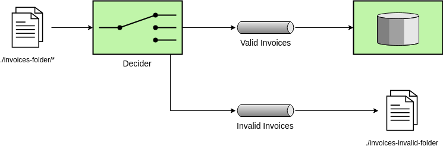

# Camel Example

This project intends to show how Camel can abstract implementation
when dealing with different type of protocols

## A Little History

Companies always need to integrate different systems, doing so they come across some
challenges... Camel comes with the responsibility to prevent us from reinventing the
wheel by providing easy methods to track, handle and deliver messages

## Case 1

You need to consume some xmls from `./invoices-folder/*` then
 - Send xmls with the tag `<valid>true</valid>` to `QUEUE:VALID_INVOICES` then to `DATABASE`
 - Send xmls with the tag `<valid>false</valid>` to `QUEUE:INVALID_INVOICES` and save them into `./invalid-invoices-folder`

[Camel Route Implementation](./src/main/java/poc/routes/MainRoute.groovy)

